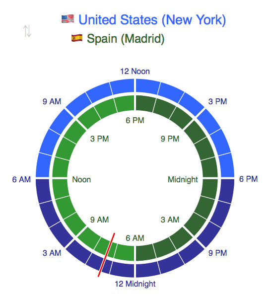

Time Zone Planner
=================

Time Zone Planner is a tool to help visualize the difference between two time zones. It is easy enough to find out the current time in a different time zone, however doing mental math while juggling two time zones can be a surprisingly frustrating task. This tool aims to serve as a visual aid when you are trying to schedule a video conference when it's morning in London but not during Washington DC's lunch hour. Or when you are trying to figure out what time it will be in Boston if you want to call your sister in Seattle between when she gets home from work and when she sits down to eat dinner.

An running example of this tool can be found at [lowellosaurus.com/timezone](http://lowellosaurus.com/timezone/).

Getting Started
---------------

### tz_list.js

This tool expects one file which is not included in the repo: `tz_list.js`. `tz_list.js` needs sit in the same directory as all of the other files in the repo, and needs to contain a function named `TimeZoneList()` which returns an object literal composed of time zone objects. Something like:

    return {
        "afghanistan": {
            "flag": "&#x1F1E6;&#x1F1EB;",
            "title": "Afghanistan",
            "offset": 4.5
        },
        ...
        "zimbabwe": {
            "flag": "&#x1F1FF;&#x1F1FC;",
            "title": "Zimbabwe",
            "offset": 2
        }
    };

The entire purpose of including the `abbr_list.txt` and `build_country_list.php` is to programatically generate `tz_list.js`. You can whittle down the list of countries in `abbr_list.txt` in order to reduce the number of options in the dropdowns. And you can build the `tz_list.js` file by running the following command:

    $> php build_country_list.php --file abbr_list.txt > tz_list.js

`tz_planner.js` expects `TimeZoneList()` to return an object literal which has--at a minimum--the keys *united_states_new_york* and *spain_madrid*. These are used as the default time zones, and can be changed in `tz_planner.js`'s `drawChart()` function if you desire.

### Being daylight saving time safe

The primary reason why I did not include `tz_list.js` in the repo is so that the file could be programmatically generated in order for the live version of the tool to be up to date as daylight saving time comes and goes in different parts of the world. I run a shell script that looks something like the following every half hour for that very reason.

    LOG_DIR="~/log"
    TIMEZONE_DIR="~/tz"

    LOG_FILE="$LOG_DIR/build_list.log"
    echo `date +"%F %T"` "Starting to build timezone list" >> $LOG_FILE

    CURR_LIST_FILE="$TIMEZONE_DIR/tz_list.js"
    NEW_LIST_FILE="$CURR_LIST_FILE."`date +%F_%H%M`

    COUNTRY_LIST="$TIMEZONE_DIR/abbr_list.txt"

    php $TIMEZONE_DIR/build_country_list.php --file $COUNTRY_LIST > $NEW_LIST_FILE

    DIFF_OUT=`diff --unified=1 $CURR_LIST_FILE $NEW_LIST_FILE`

    if [[ $DIFF_OUT == "" ]]; then    
        echo `date +"%F %T"` "No change to timezone list since last generated" >> $LOG_FILE
    else
        echo `date +"%F %T"` "$DIFF_OUT" >> $LOG_FILE

        if [[ `cat $CURR_LIST_FILE | wc -l` == `cat $NEW_LIST_FILE | wc -l` ]]; then
            echo `date +"%F %T"` "Updating timezone file" >> $LOG_FILE
            
        ARCHIVED_LIST_FILE="$LOG_DIR/tz_list/"`date +%F_%H%M`".js"
            
        ARCHIVE_CMD_OUT=`cp $CURR_LIST_FILE $ARCHIVED_LIST_FILE`
        if [[ $ARCHIVE_CMD_OUT != "" ]]; then
            echo `date +"%F %T"` "Error occurred when archiving $CURR_LIST_FILE to $ARCHIVED_LIST_FILE: $ARCHIVE_CMD_OUT" >> $LOG_FILE
        fi

            REPLACE_CMD_OUT=`cp $NEW_LIST_FILE $CURR_LIST_FILE`
        if [[ $REPLACE_CMD_OUT != "" ]]; then
            echo `date +"%F %T"` "Error occurred when replacing $CURR_LIST_FILE with $NEW_LIST_FILE: $REPLACE_CMD_OUT" >> $LOG_FILE
        fi
        else
            echo `date +"%F %T"` "Newly generated timezone list has a different number of lines. Keeping previous list" >> $LOG_FILE
        fi
    fi

    rm $NEW_LIST_FILE

Worth noting: since the time zone list generator is written in php, if the built-in php time zone functions fall out of date then the list will also fall out of date.

Caveat Emptor
-------------

This project was undertaken to scratch a personal itch and, as such, it is personalized to how I use it. Your mileage may vary.

Windows and Samsung [do not support flag emoji](http://emojipedia.org/flags/), so flags will display as their corresponding two letter country codes.

Additionally, my apologies for all of the non-idiomatic or inefficient javascript, php, or css I've written. I used this project to exercise my dust off my skills in those languages as I've not touched them in more than a year... Not that I was much better writing in them then.

I have made no effort at compatability with Internet Explorer or any other browser, and as a result it may look wonky to you. `document.body.remove()` seems to throw at least a few versions of IE for a loop (if you have any advice on this, it'd be much appreciated).

Todo
----

- Make `tz_planner.js` and `tz_conv.css` independent of one another.
- The dial is too large. Make it about 2/3 the size.
- Make the dropdown function like an actual dropdown (for the benefit of iPhones mostly).
- Make the dropdown multi-dimensional with each country taking up one option and the timezones within that country constituting the subsequent dropdown (so that Australia doesn't dominate the entire list).
- Add the ability to include default time zones in the URL (e.g. .../timezone/france/japan).
- Make it work in IE. Doesn't like `document.body.remove()`.
- Highlight the first dropdown menu when the page first loads to hint that they are selectable, then fade out.
- Add current time after dropdown boxes.
